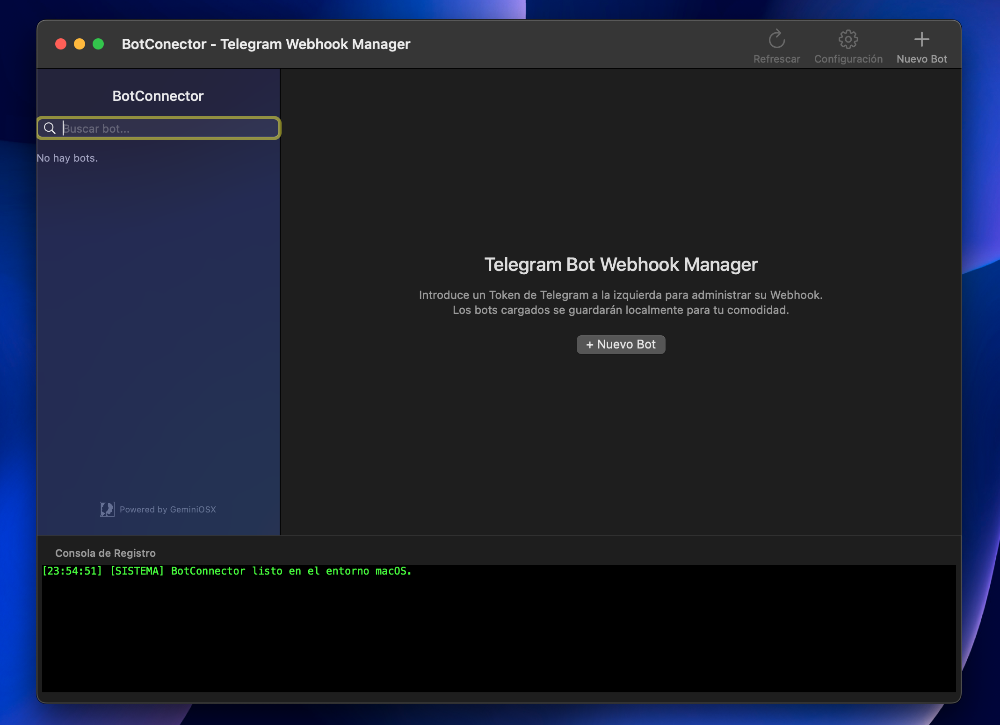

# BotConnector

  
  
  
  

  

**BotConnector** es un gestor de Webhooks y Webhook Bots de Telegram nativo para macOS. Permite monitorizar métricas de rendimiento de tus bots en tiempo real, supervisar logs del sistema y administrar múltiples tokens de bot simultáneamente mediante una interfaz de usuario minimalista y optimizada para el sistema operativo Apple.

[Descargar última versión](https://github.com/iGeminix-dev/botconnector-mac/releases/latest) • [Reportar Bug](https://github.com/iGeminix-dev/botconnector-mac/issues) • [Preguntas Frecuentes](docs/TROUBLESHOOTING.md)

---

## Características Principales

- **Gestión Multi-Bot**: Conecta, desconecta y monitorea múltiples bots de Telegram con un solo clic.
- **Métricas en Tiempo Real**: Observa de manera instantánea el tráfico de red, memoria, base de datos y número de usuarios activos.
- **Herramientas de Diagnóstico**: Botón integrado para reiniciar la cola de mensajes acumulados y depurar errores.
- **Consola de Logs Interactiva**: Filtros avanzados para visualizar las comunicaciones entre la API de Telegram y tus bots.
- **100% Nativo**: Desarrollado en Objective-C/Cocoa, garantizando mínima huella de memoria y soporte completo para Light/Dark Mode de macOS.

## Requisitos del Sistema

- **Sistema Operativo**: macOS 10.13 (High Sierra) o posterior.
- **Procesador**: Compatible con Apple Silicon (M1/M2/M3) y procesadores Intel.
- **Espacio en Disco**: Menos de 15 MB.

## Instalación rápida

1. Ve a la sección de [Releases](https://github.com/iGeminix-dev/botconnector-mac/releases/latest).
2. Descarga el archivo `.dmg` o `.zip`.
3. Abre el archivo descargado.
4. Arrastra `BotConnector.app` a tu carpeta `/Applications` (Aplicaciones).
5. Abre la aplicación desde Launchpad o Finder.

*Nota: Dado que la aplicación no se distribuye a través del App Store de Apple, es posible que debas autorizar su ejecución en Preferencias del Sistema > Seguridad y Privacidad si no cuentas con una firma de desarrollador Apple registrada.*

## Seguridad e Integridad

El binario de BotConnector está compilado utilizando técnicas de ofuscación avanzadas (Hikari LLVM) para proteger la propiedad intelectual de GeminiOSX. Adicionalmente, cada release incluye sumas de verificación SHA-256 para garantizar la integridad del archivo descargado.

---

Desarrollado y mantenido con ❤️ por [GeminiOSX](https://github.com/iGeminix-dev).
